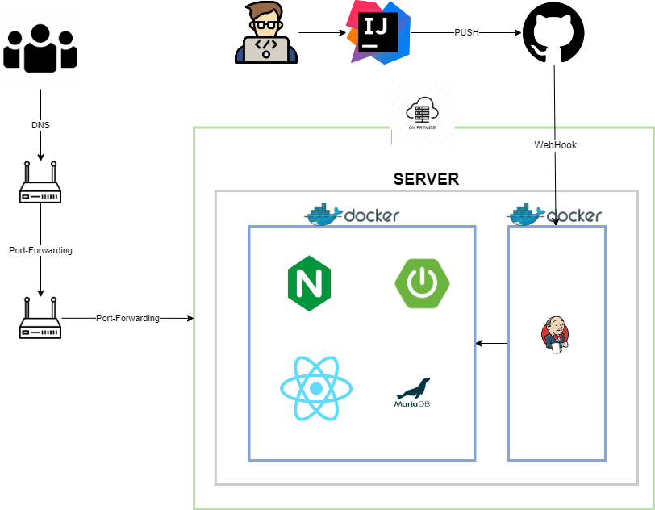

# Piece 프로젝트 


## 목차
[1. 프로젝트 개요](#1-프로젝트-개요) <br>
[2. 프로젝트 구성도](#2-프로젝트-구성도) <br>
[3. 개발 환경 및 기술 스택](#3-개발-환경-및-기술-스택) <br>
[4. 개발 전략](#4-개발-전략) <br>
[5. 실행 방법](#5-실행-방법) <br>
[6. 기능](#6-기능) <br>
[7. 팀원 소개](#7-팀원-소개) <br>
[8. 기타 사항](#8-기타-사항) <br>

## 1. 프로젝트 개요

------------
> SNS 서비스는 IT 업계에서 많은 유저들에게 선호되고 있는 서비스중 하나입니다. <br>
> 기존 서비스를 모티브하여 해당 서비스에서 필요로 하는 `다양한 기술 및 비지니스를 이해 할 수 있는 프로젝트`가 될 수 있기에 선택하게 되었습니다. <br>
> `피스`는 연인에게 제공되는 이용 계층을 설정한 서비스로 둘만의 공간에서 다양한 경험을 할 수 있게 제공 예정입니다. <br>
> 2024년도 개발 예정 기능 `사진 공유`, `채팅` 을 목표로 개발을 진행 할 것입니다.

## 2. 프로젝트 구성도

------------



- 인프라 구성은 `네이버 클라우드` 통하여 서버 임대 예정이며 비용 및 서버 스펙에 따라서 다른 클라우드(AWS 등..) 환경으로 변경 할 수 있습니다.
- `CI/CD를 구축`으로 개발부터 배포까지 자동화하여 빠르게 서비스를 런칭하게 구성하였습니다.
- 해당 프로젝트 경우 학습 및 경험을 목표로 하고 있기에 `데이터베이스 경우는 on-premise` 로 구성하여 비용 절감을 진행할 예정입니다.

## 3. 개발 환경 및 기술 스택

------------

### Server
  - Java 8
  - Java 17
  - Spring 2.7.x
  - Spring 3.2.x
  - Maria DB 10.6.8

### 프론트
  - react 18
  - nginx 1.18.0

### Devops
  - jenkis 2.4x
  - docker 26.0.0
  - naver cloud
  - gitub

### Tool
  - intelliJ
  - ubuntu-20.04

[목차로 이동](#목차)

## 4. 개발 전략

------------

### 배포 전략
> 롤링배포 + 블루/그린 배포 전략 선택 <br> 
> TEST 컨테이너를 통하여 이상여부 확인 후, 서비스 전환 

<br>

### 브랜치 전략
> Git-flow 전략을 기반으로 main, develop branch 와 feature 보조 브랜치 운용 <br>
> main, develop, feature 브랜치로 나누어 개발
> > main 브랜치: 배포 브랜치 <br>
> > develop 브랜치: 개발 단계에서 git-flow의 master 역할을 하는 브랜치 <br>
> > feature 브랜치: 기능 단위로 독립적인 개발 환경을 위하여 사용

[목차로 이동](#목차)

## 5 실행 방법

------------

### Java

<br>

Install

```angular2html

```


### React

<br>

Install

```angular2html

```

[목차로 이동](#목차)

## 6. 기능

------------
1. 사진첩 기능 (개발 예정)
2. 채팅 기능 (개발 예정)

[목차로 이동](#목차)
## 7. 팀원 소개

------------

<div align="center">


|                         **김범신**                        |                       **오가희**                      |
|:--------------------------------------------------------:|:----------------------------------------------------:|
| [ <br/> @beomshinkim]() | [ <br/> @ohgahee]() |

</div>

[목차로 이동](#목차)

## 8. 기타 사항

------------

- [API규격](http://123.com)
- [히스토리](http://123.com)

[목차로 이동](#목차)